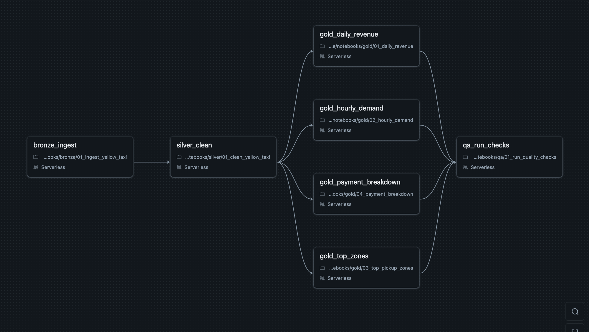
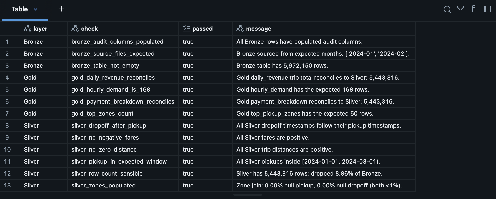

# Databricks Medallion Pipeline

> Production-shaped Bronze → Silver → Gold data pipeline on Databricks. PySpark, Delta Lake, and the NYC TLC taxi-trip dataset — with data-quality checks at every layer and a SQL dashboard at the end.

<p align="center">
  
</p>

---

## 🔁 Orchestration — the whole pipeline as one Databricks Workflow

<p align="center">
  
</p>

All six notebooks are chained into a single Databricks Job. `bronze_ingest` pulls the raw parquet files from the public source. `silver_clean` applies quality filters and joins the taxi-zone reference. The four Gold aggregators run in parallel — they only read from Silver and write independent tables. `qa_run_checks` runs last, after every Gold table has been refreshed, validating all 13 layer contracts. A single click rebuilds the entire pipeline from source to dashboard.

---

## 📈 The result — a working dashboard

<p align="center">
  
</p>

The dashboard reads from four pre-aggregated Gold Delta tables (a total of ~280 rows distilled from 5.97 million raw trips). It surfaces five things at a glance: total revenue and trip count for the period, the daily revenue rhythm with its visible weekday/weekend cadence, the hour-of-week demand heatmap (Thursday/Friday evenings dominate), the top 15 pickup zones colour-coded by borough, and the payment-method split with the well-known cash-tip blind spot.
The dashboard is published inside Databricks Free Edition, which doesn't currently support public link sharing — the screenshot above is captured directly from the live view, queried against the Gold Delta tables in real time.

---

## 🎯 Goal

Build the canonical production data-engineering pattern end-to-end, on real public data large enough that Spark actually matters: ingest raw trip records into a Bronze layer with full lineage, clean and enrich them into Silver, aggregate into business-ready Gold tables, and expose the result through a Databricks SQL dashboard. Document the data-quality strategy honestly along the way.

This is what real teams build behind every analytics platform at Capgemini's banking and insurance clients. The dataset is different; the architecture is the same.

---

## 🏛️ The medallion pattern, in plain words

| Layer | Purpose | Transformations |
|---|---|---|
| **🥉 Bronze** | Faithful copy of the source. Nothing dropped, nothing transformed. | Schema-on-read, audit columns (`_ingested_at`, `_source_file`). |
| **🥈 Silver** | Clean, typed, and enriched. The reusable single source of truth. | Type enforcement · quality filters (negative fares, impossible distances) · join with taxi-zone reference. |
| **🥇 Gold** | Business-ready aggregates. Optimised for read patterns. | Daily revenue · hourly demand · zone popularity · payment-method splits. |

Each layer is a **Delta table** — ACID transactions, time travel, and schema evolution come for free.

---

## 🛠️ Stack

| Layer | Choice | Why |
|---|---|---|
| Platform | **Databricks Free Edition** | Serverless compute, free tier, real Databricks UI. |
| Language | **PySpark** (Python on Spark) | Industry standard, what real teams use. |
| Storage | **Delta Lake** | The Databricks differentiator — ACID + time travel. |
| Source control | **Databricks Repos ↔ GitHub** | Notebooks committed as `.py` files in this repo. |
| Visualisation | **Databricks SQL dashboards** | Native, no extra service to deploy. |
| Data quality | **Custom PySpark assertions** | Honest, lightweight, no extra dependency. |
| Orchestration | **Databricks Workflows** *(planned)* | Free-tier supports basic multi-task jobs. |

---

## 📊 Dataset — NYC TLC Taxi Trips

The [NYC Taxi & Limousine Commission's public dataset](https://www.nyc.gov/site/tlc/about/tlc-trip-record-data.page) is the canonical large public dataset for data-engineering practice. The full archive is over a billion rows; this project uses a recent **1–2 month slice (~10–20M rows)** of yellow taxi trips — substantial enough that Spark earns its keep, small enough to fit comfortably inside Free Edition's quotas.

The data has all the messiness that makes it interesting: negative fares, zero-distance trips, timestamps before the pickup, GPS coordinates dropped to (0, 0), and a separate taxi-zone reference file that must be joined in.

---

## 🚀 Quickstart

```bash
# 1. Clone
git clone https://github.com/hugocorreia123/databricks-medallion-pipeline.git
cd databricks-medallion-pipeline

# 2. (Local-only) create a venv for any local helpers
python3.11 -m venv .venv
source .venv/bin/activate
pip install -r requirements.txt

# 3. Connect Databricks Repos to this repo
#    Databricks workspace → Workspace → Repos → Add Repo
#    Paste the URL of this repo. Databricks will clone it into your workspace.

# 4. Open the notebooks in order:
#    notebooks/bronze/01_ingest_yellow_taxi.py
#    notebooks/silver/01_clean_yellow_taxi.py
#    notebooks/gold/01_daily_revenue.py        (and the rest)
#    notebooks/utils/data_quality.py           (used by the above)
```

---

## 📁 Repository structure

```
databricks-medallion-pipeline/
├── notebooks/
│   ├── bronze/         # Raw ingestion notebooks
│   ├── silver/         # Cleaning, typing, enrichment
│   ├── gold/           # Business aggregations
│   └── utils/          # Shared helpers (logging, schemas, QA)
├── src/                # Local Python (helpers, tests)
│   ├── utils/
│   └── tests/
├── data/
│   ├── raw/            # Pointers to source data (the data itself lives in Databricks)
│   └── reference/      # Small lookup tables (taxi zones)
├── docs/
│   ├── architecture/   # Diagrams (Mermaid source + PNG)
│   └── screenshots/    # Databricks UI screenshots, dashboard captures
├── scripts/            # One-shot utilities
├── README.md
├── LICENSE             # MIT
└── .gitignore
```
---

## ✅ Data quality & lessons learned

A medallion pipeline is only as trustworthy as the contracts between its layers. This project includes a small custom assertion framework (`notebooks/utils/data_quality_checks.py`) that validates 13 contracts across Bronze, Silver, and Gold, and a runner notebook (`notebooks/qa/01_run_quality_checks.py`) that executes them and prints a clean pass/fail report.

<p align="center">
  
</p>

The most important check is the **reconciliation assertion** at the Gold layer: the sum of `trip_count` in `gold.daily_revenue` must equal the row count of `silver.yellow_taxi`. If aggregation is silently dropping rows, this check catches it. Both `daily_revenue` and `payment_breakdown` reconcile to exactly **5,443,316** — the Silver row count — meaning no rows were lost in aggregation.

### What we discovered while building

Two non-obvious findings emerged during this project, both worth documenting honestly because they're typical of how real data engineering goes:

**1. Eighteen timestamp glitches in NYC TLC data.** The first version of the Silver layer had filters for negative fares, zero-distance trips, dropoff-before-pickup, and impossible passenger counts. It passed eyeball inspection. But when the Gold `daily_revenue` aggregate ran, its date range came back as `2002-12-31 → 2024-03-01` — clearly wrong. A diagnostic groupBy on `year(tpep_pickup_datetime)` revealed eighteen stray rows scattered across 2002, 2008, 2009, 2023, and March 2024. The TLC dataset occasionally contains records with corrupted pickup timestamps that look fine until they hit a daily aggregate. The fix was a two-line filter pinning the pickup window to `[2024-01-01, 2024-03-01)`, plus the assertion `silver_pickup_in_expected_window` to catch any recurrence. The broader lesson: downstream aggregates are themselves a data-quality test, and they sometimes reveal upstream issues no row-level check would surface.

**2. Cash tips are systematically zero.** The Gold `payment_breakdown` table shows credit-card trips averaging **$4.15** in tips and cash trips averaging **$0.00**. This is not a real customer-behaviour pattern — it's a known TLC reporting artefact. The trip-record schema only captures tips that flow through the in-cab payment terminal; cash tips handed directly to the driver are invisible to the data. Any tip-related analysis built on this Gold table is therefore biased downward, and any business question of the form "are drivers earning enough?" cannot be answered from TLC data alone. We surface this caveat openly in the dashboard rather than presenting a deceptively clean total-tips KPI.

### How to extend the framework

Each check is a one-function `(spark) -> (passed, message)` contract. Adding a new check is twelve lines and a one-line registration in the runner. The framework deliberately uses raw PySpark rather than PyDeequ or Great Expectations because thirteen checks don't justify a heavyweight dependency — but the surface area is the same, so migration would be straightforward once the assertion library grew past roughly twenty checks.

---

## 📜 License

MIT — see [`LICENSE`](LICENSE).

---

## 👤 Author

**Hugo Correia** — Data Scientist · ML / AI Engineer · Lisbon, Portugal

[GitHub](https://github.com/hugocorreia123) · [LinkedIn](https://www.linkedin.com/in/hugogncorreia) · Hugocorreia55@hotmail.com
