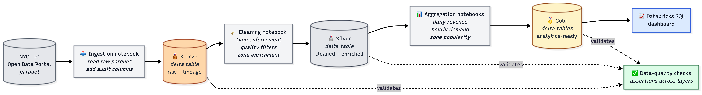
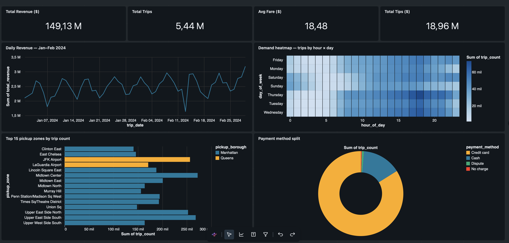

# Databricks Medallion Pipeline

> Production-shaped Bronze → Silver → Gold data pipeline on Databricks. PySpark, Delta Lake, and the NYC TLC taxi-trip dataset — with data-quality checks at every layer and a SQL dashboard at the end.

<p align="center">
  
</p>

---

## 📈 The result — a working dashboard

<p align="center">
  
</p>

The dashboard reads from four pre-aggregated Gold Delta tables (a total of ~280 rows distilled from 5.97 million raw trips). It surfaces five things at a glance: total revenue and trip count for the period, the daily revenue rhythm with its visible weekday/weekend cadence, the hour-of-week demand heatmap (Thursday/Friday evenings dominate), the top 15 pickup zones colour-coded by borough, and the payment-method split with the well-known cash-tip blind spot.
The dashboard is published inside Databricks Free Edition, which doesn't currently support public link sharing — the screenshot above is captured directly from the live view, queried against the Gold Delta tables in real time.

---

## 🎯 Goal

Build the canonical production data-engineering pattern end-to-end, on real public data large enough that Spark actually matters: ingest raw trip records into a Bronze layer with full lineage, clean and enrich them into Silver, aggregate into business-ready Gold tables, and expose the result through a Databricks SQL dashboard. Document the data-quality strategy honestly along the way.

This is what real teams build behind every analytics platform at Capgemini's banking and insurance clients. The dataset is different; the architecture is the same.

---

## 🏛️ The medallion pattern, in plain words

| Layer | Purpose | Transformations |
|---|---|---|
| **🥉 Bronze** | Faithful copy of the source. Nothing dropped, nothing transformed. | Schema-on-read, audit columns (`_ingested_at`, `_source_file`). |
| **🥈 Silver** | Clean, typed, and enriched. The reusable single source of truth. | Type enforcement · quality filters (negative fares, impossible distances) · join with taxi-zone reference. |
| **🥇 Gold** | Business-ready aggregates. Optimised for read patterns. | Daily revenue · hourly demand · zone popularity · payment-method splits. |

Each layer is a **Delta table** — ACID transactions, time travel, and schema evolution come for free.

---

## 🛠️ Stack

| Layer | Choice | Why |
|---|---|---|
| Platform | **Databricks Free Edition** | Serverless compute, free tier, real Databricks UI. |
| Language | **PySpark** (Python on Spark) | Industry standard, what real teams use. |
| Storage | **Delta Lake** | The Databricks differentiator — ACID + time travel. |
| Source control | **Databricks Repos ↔ GitHub** | Notebooks committed as `.py` files in this repo. |
| Visualisation | **Databricks SQL dashboards** | Native, no extra service to deploy. |
| Data quality | **Custom PySpark assertions** | Honest, lightweight, no extra dependency. |
| Orchestration | **Databricks Workflows** *(planned)* | Free-tier supports basic multi-task jobs. |

---

## 📊 Dataset — NYC TLC Taxi Trips

The [NYC Taxi & Limousine Commission's public dataset](https://www.nyc.gov/site/tlc/about/tlc-trip-record-data.page) is the canonical large public dataset for data-engineering practice. The full archive is over a billion rows; this project uses a recent **1–2 month slice (~10–20M rows)** of yellow taxi trips — substantial enough that Spark earns its keep, small enough to fit comfortably inside Free Edition's quotas.

The data has all the messiness that makes it interesting: negative fares, zero-distance trips, timestamps before the pickup, GPS coordinates dropped to (0, 0), and a separate taxi-zone reference file that must be joined in.

---

## 🚀 Quickstart

```bash
# 1. Clone
git clone https://github.com/hugocorreia123/databricks-medallion-pipeline.git
cd databricks-medallion-pipeline

# 2. (Local-only) create a venv for any local helpers
python3.11 -m venv .venv
source .venv/bin/activate
pip install -r requirements.txt

# 3. Connect Databricks Repos to this repo
#    Databricks workspace → Workspace → Repos → Add Repo
#    Paste the URL of this repo. Databricks will clone it into your workspace.

# 4. Open the notebooks in order:
#    notebooks/bronze/01_ingest_yellow_taxi.py
#    notebooks/silver/01_clean_yellow_taxi.py
#    notebooks/gold/01_daily_revenue.py        (and the rest)
#    notebooks/utils/data_quality.py           (used by the above)
```

---

## 📁 Repository structure

```
databricks-medallion-pipeline/
├── notebooks/
│   ├── bronze/         # Raw ingestion notebooks
│   ├── silver/         # Cleaning, typing, enrichment
│   ├── gold/           # Business aggregations
│   └── utils/          # Shared helpers (logging, schemas, QA)
├── src/                # Local Python (helpers, tests)
│   ├── utils/
│   └── tests/
├── data/
│   ├── raw/            # Pointers to source data (the data itself lives in Databricks)
│   └── reference/      # Small lookup tables (taxi zones)
├── docs/
│   ├── architecture/   # Diagrams (Mermaid source + PNG)
│   └── screenshots/    # Databricks UI screenshots, dashboard captures
├── scripts/            # One-shot utilities
├── README.md
├── LICENSE             # MIT
└── .gitignore
```
---

## 📜 License

MIT — see [`LICENSE`](LICENSE).

---

## 👤 Author

**Hugo Correia** — Data Scientist · ML / AI Engineer · Lisbon, Portugal

[GitHub](https://github.com/hugocorreia123) · [LinkedIn](https://www.linkedin.com/in/hugogncorreia) · Hugocorreia55@hotmail.com
